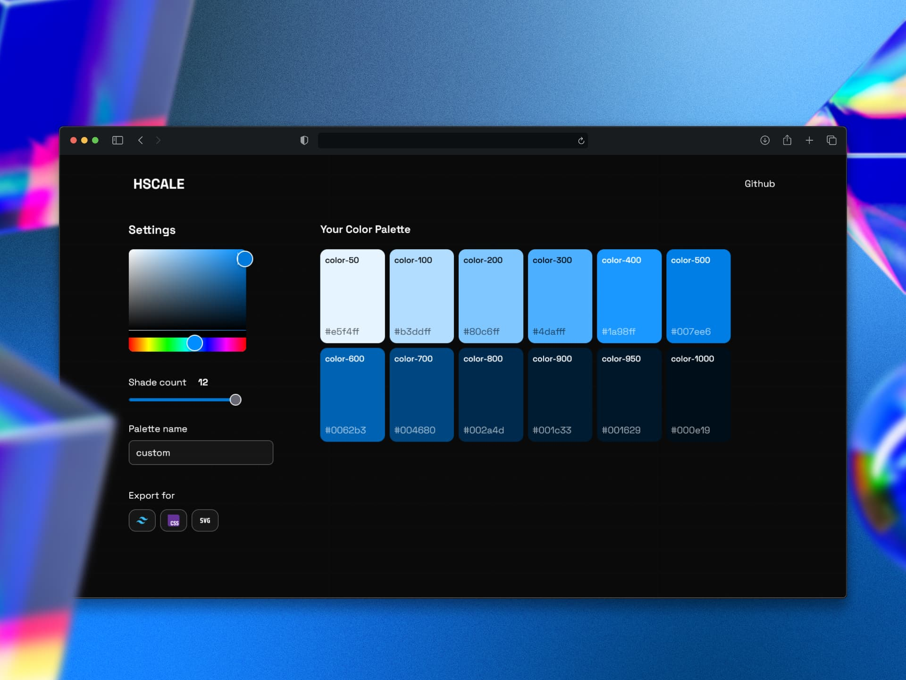

# hcale

This is a React project bootstrapped with Vite.

## Screenshots


## About the project

This project is a simple color picker application that allows you to select a color and get its hexadecimal, RGB, and HSL values. It also has a feature to generate a random color and a list of the latest colors selected.

## Getting Started

To get a local copy up and running, follow these simple steps.

### Prerequisites

Make sure you have [Node.js](https://nodejs.org/) and [pnpm](https://pnpm.io/) installed.

### Installation

1. Clone the repo
   ```sh
   git clone https://github.com/your_username/hcale.git
   ```
2. Install NPM packages
   ```sh
   pnpm install
   ```

## Available Scripts

In the project directory, you can run:

### `pnpm dev`

Runs the app in the development mode.<br>
Open [http://localhost:5173](http://localhost:5173) to view it in the browser.

The page will reload if you make edits.<br>
You will also see any lint errors in the console.

### `pnpm build`

Builds the app for production to the `dist` folder.<br>
It correctly bundles React in production mode and optimizes the build for the best performance.

The build is minified and the filenames include the hashes.<br>
Your app is ready to be deployed!

### `pnpm lint`

Lints the project files using ESLint.

### `pnpm preview`

Serves the production build locally.

## Dependencies

- [@fontsource-variable/space-grotesk](https://www.npmjs.com/package/@fontsource-variable/space-grotesk)
- [@tailwindcss/vite](https://www.npmjs.com/package/@tailwindcss/vite)
- [@uiw/react-color-colorful](https://www.npmjs.com/package/@uiw/react-color-colorful)
- [react](https://www.npmjs.com/package/react)
- [react-dom](https://www.npmjs.com/package/react-dom)
- [sonner](https://www.npmjs.com/package/sonner)
- [tailwindcss](https://www.npmjs.com/package/tailwindcss)
- [motion](https://www.npmjs.com/package/motion)
